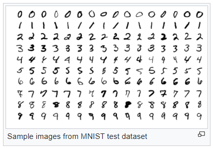

# ML Handwritten Number Gusser

# About Data
Here i am using mnist dataset which is internally existed in tensorflow library.
The MNIST database (Modified National Institute of Standards and Technology database) is a large database of handwritten digits that is commonly used for training various image processing systems.The database is also widely used for training and testing in the field of machine learning.

The MNIST database contains 60,000 training images and 10,000 testing images. Half of the training set and half of the test set were taken from NIST's training dataset, while the other half of the training set and the other half of the test set were taken from NIST's testing dataset.

Each example in this dataset has an input of 28x28 pixel of a handwritten number image. So don't forget to resize the image of the handwritten number before feeding it to the model to predict. 

I am using Paint program to draw the handwritten numbers and resize it to be 28x28 pixels before passing it to the model.

# Project Video
Here is a link for the project video >> [LINK](https://drive.google.com/file/d/1KFV_lkUZzCzwTrGPdO2u20HTngUG45iu/view?usp=sharing)
